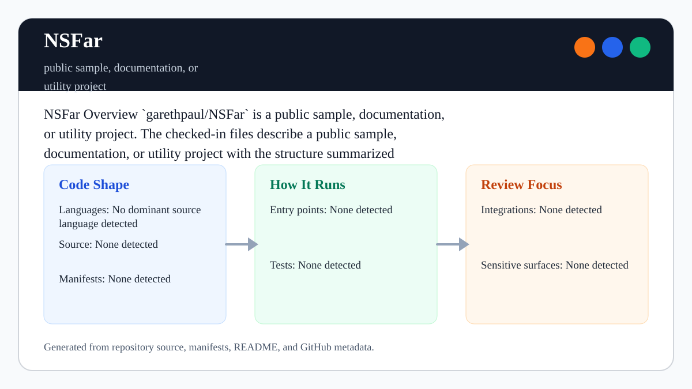

# NSFar

<!-- README-OVERVIEW-IMAGE -->


## Overview

`garethpaul/NSFar` is a public sample, documentation, or utility project. The checked-in files describe a public sample, documentation, or utility project with the structure summarized below.

This README is based on the checked-in source, manifests, scripts, and repository metadata on the `master` branch. The project language mix found during review was: no dominant source language detected.

## Repository Contents

- `.gitignore` - local environment/log/temp ignores
- `CHANGES.md` - baseline change log
- `Makefile` - local static verification entry point
- `README.md` - project overview and local usage notes
- `SECURITY.md` - security reporting and disclosure guidance
- `VISION.md` - project direction and maintenance guardrails
- `gitfiti` - preserved 2,889-line numeric artifact with values from 0 through 17
- `scripts/check-baseline.py` - archive/artifact baseline checks

Additional scan context:

- Source directories: no top-level source directories detected
- Dependency and build manifests: none detected
- Entry points or build surfaces: `gitfiti`
- Test-looking files: `scripts/check-baseline.py`

## Getting Started

### Prerequisites

- Git

### Setup

```bash
git clone https://github.com/garethpaul/NSFar.git
cd NSFar
make lint
make test
make build
make check
```

The setup commands above are derived from repository files. Legacy mobile, Python, or JavaScript samples may require older SDKs or package versions than a modern workstation uses by default.

## Running or Using the Project

- There is no installable runtime in the current repository.
- Treat `gitfiti` as a preserved numeric artifact until provenance or
  regeneration notes are added.
- [`docs/artifact-provenance.md`](docs/artifact-provenance.md) records that the
  file was built by 2,889 one-line-addition commits while leaving the generator,
  source instructions, and intended rendered pattern explicitly unresolved.
- `docs/artifact-manifest.json` records the artifact path, byte size, line
  count, value range, value counts, encoding, format, line ending, terminal
  newline state, file mode, distinct values, sequence boundary values, value
  count total, and checksum.
- The artifact manifest uses schema version 1 so future metadata changes are
  explicit. Validation requires its exact key set, so misspelled, obsolete, or
  undocumented fields cannot silently extend the archive contract.
- The artifact is preserved as a non-executable `100644` file mode.
- `.gitattributes` pins the `gitfiti` artifact and manifest to LF line endings
  so byte-sensitive archive files do not drift across checkouts.
- Current artifact checksum: SHA-256
  `89d4697d0d5d78624761159d4371a135124f4c10169e65018eb3b825afbb66d4`.

## Testing and Verification

- `make lint`
- `make test`
- `make build`
- `make check`
- `python3 scripts/check-baseline.py`
- Pinned `ubuntu-24.04` GitHub Actions runs the same byte-sensitive artifact and
  manifest integrity checks on Python 3.12. The checkout credentials are not
  persisted after source retrieval.

When the required SDK or runtime is unavailable, use static checks and source review first, then verify on a machine that has the matching platform toolchain.

## Configuration and Secrets

- No required secret or credential file was identified in the repository scan. If you add integrations later, keep secrets out of git.

## Security and Privacy Notes

- The scan did not identify production authentication, payment, or secret-management code. Treat future additions in those areas as security-sensitive.
- Do not rewrite the `gitfiti` numeric artifact without a reproducible source or
  documented provenance.
- Construction history is not a reproduction recipe; do not regenerate the
  artifact from a guessed tool, image, or interpretation.
- Keep the artifact manifest aligned with the checked-in artifact whenever
  archive metadata changes.
- Keep artifact distinct values documented in the manifest so the observed
  value domain remains explicit.
- Keep artifact boundary values documented in the manifest so sequence-edge
  drift remains visible.
- Keep the manifest value count total aligned with the artifact line count and
  value-count histogram.
- Keep the manifest sequence shape aligned with the artifact's 318 zero-based
  ascending runs and checked run-length histogram.
- Keep the schema version 1 manifest on its exact key set; add or remove fields
  only through a deliberate schema and validator update.
- Keep the artifact file mode non-executable unless provenance explains why it
  should change.
- Keep `.gitattributes` line-ending rules in place for byte-sensitive archive
  files.

## Maintenance Notes

- Run `make lint`, `make test`, `make build`, and `make check` before changing
  the artifact or archive metadata.
- See `docs/plans/2026-06-09-make-gate-aliases.md` for the local verification
  gate aliases.
- See `SECURITY.md` for vulnerability reporting and safe research guidance.
- See `VISION.md` for project direction and contribution guardrails.

## Contributing

Keep changes small and tied to the project that is already present in this repository. For code changes, document the toolchain used, avoid committing generated dependency directories or local configuration, and update this README when setup or verification steps change.
